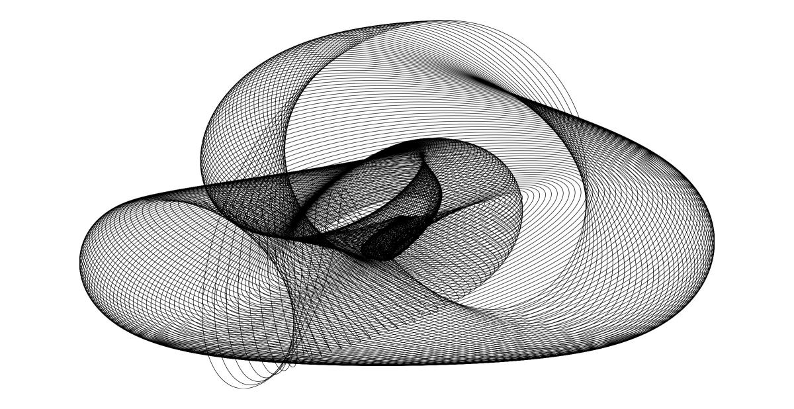
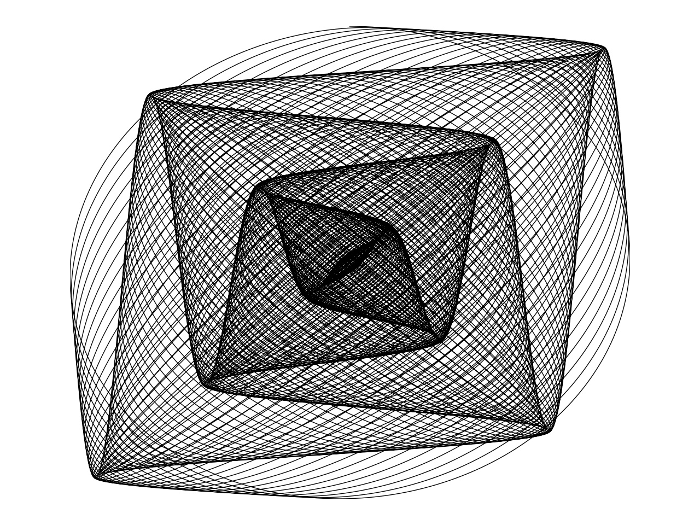

# Harmonograph simulators using numpy and matplotlib

Copyright 2017 Alan Richmond @ Python3.codes https://opensource.org/licenses/MIT

There are 2 programs here. The first is a simple bare-bones program that gets a couple of parameters from the user and draws a random harmonograph. The second is a full-fledged GUI with buttons and sliders to allow the creation of user-specified harmonographs, or random ones that can be used as a starting point for user adjustments.

* * *
## Basic Principles

Harmonographs are mechanical devices, frequently seen in science museums, comprising a small number of pendulums which are inter-connected in such a way as to control the movement of a pen, which rests on a sheet of paper. Their motion causes intricate patterns to be drawn on the paper - which may also be moved by its own pendulum.

The movement imparted by each pendulum is basically damped simple harmonic motion x = a * sin (t * f + p) * exp(-d * t), where a, f, and p are the amplitude, frequency, and phase of the sine wave. t is time, and d is a damping factor due to friction and air resistance. An orthogonal pendulum can add motion in the y axis, with different values of a, f, and p (d could also be different but we'll ignore that). We can add more pendulums for more sophisticated drawings, but in practice, 2 or 3 pendulums works very well.

This device is very easily simulated in a program, especially if we take advantage of Python's numpy and matplotlib libraries.

## random-harmonograph.py

This is a simple harmonograph simulator to generate random-ish harmonographs. It asks for the number of pendulums, and exits if the number is 0\. It also asks for the frequency spread, which means roughly, how far from integer may the frequencies go. The nearer to integer they are, the 'cleaner' looking the harmonographs are, but they tend to be perhaps less interesting. The further from integer they are, the more they're likely to look messy.

If you've seen harmonograph programs before, you might expect there to be an outer loop for stepping through the 'time' variable. That's not necessary here because numpy handles it for us, making the program simpler and much faster. The outer loop here is gets user input and generates random parameters for each pendulum's oscillation (i.e. sine wave): amplitude, frequency, and phase. The one inner loop computes, for each pendulum, the whole x and y vectors, at once. That is, numpy notices that 't' is a vector and so knows to compute x and y using faster code than Python (C).

Each picture is drawn in its own window, which remains on screen until the program exits, or you dismiss it. This way, you can compare several pictures and select the best if you want to keep some. To save a picture, click on the floppy disc icon on the window's menu bar.

## gui-harmonograph.py

Based on the previous one, but now with GUI radio buttons for selecting one of the pendulums, sliders for setting pendulum sine wave properties, i.e. amplitude, frequency, and phase. There are also sliders for setting the decay rate, and number of steps. You can also specify thin/thick line width, and create a random harmonograph, which you can then modify with the sliders.

Again, you can save pictures using the floppy-disc save icon.

### Some Tips for Getting Good Pictures

You probably started by clicking the Random button a few times, and maybe moving the sliders around. Good! I hope you figured out that the 'radio buttons' on the left select which pendulum is controlled by the sliders. When you have done that, exit the program and restart it. 

The drawing you now see is the simplest harmonograph: the same frequencies in x and y on one pendulum, with phases selected to cause circular or elliptical motion when the damping is zero; otherwise the motion slowly decays, and the pen spirals inwards. If the damping is maximal, the pen spirals completely in to a central point. The decay isn't the usual exponential, I find that a linear damping gives better results, e.g. avoiding a black muddle in the middle.

Now use the arrow keys to vary the x or y frequencies very slowly (if nothing happes, click on the Harmonograph Controls box). These have the greatest effect on the character of the picture. Normally, you would set amplitude to 0 or 1. If the amplitude is 0, the other controls for that pendulum, in that direction (x or y) will have no effect. The most pleasing pictures occur near small integer multiple ratios, e.g. 1:1, 1:2, 1:3, 2:3, 3:4. This doesn't necessarily mean the frequencies themselves have to be integers, but their ratios do. However, the easiest way to do that is when at least one of them is (near) an integer.

The picture below was obtained by starting with the x and y frequencies the same for pendulum 1, and then hitting the up arrow key several times. You should increase the number of Steps to fill it out a bit.

When you have found something interesting by varying the frequencies, you can then try adjusting their phases. The effect is a bit like rotating something, and indeed, if you reach one end of the phase range, and then quickly move the slider to the opposite end, you'll find that the harmonograph is the same - as if you had rotated it 360 degrees! So this is a good way to get the best view of the harmonograph.

When you have played around with just 1 pendulum, I suggest you set the frequencies back to 1:1, so that you have again the circle or ellipse. Now click on pendulum 2, and press the up arrow several times. Eventually you'll see a very nice harmonograph. And again, try varying phase, damping, and steps...
